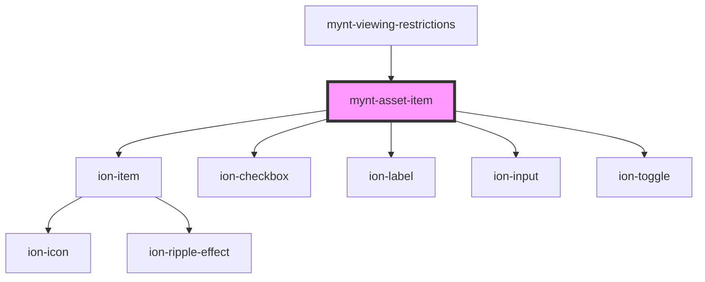

# mynt-asset-item

<!-- Auto Generated Below -->

## Dependencies

### Used by

 - [mynt-viewing-restrictions](../mynt-viewing-restrictions)

### Depends on

- ion-item
- ion-checkbox
- ion-label
- ion-input
- ion-toggle

### Graph

----------------------------------------------

*Built with [StencilJS](https://stenciljs.com/)*
