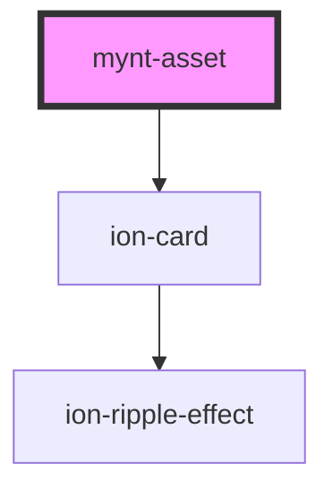

# mynt-asset

<!-- Auto Generated Below -->

## Properties

| Property | Attribute | Description | Type  | Default     |
| -------- | --------- | ----------- | ----- | ----------- |
| `cost`   | `cost`    |             | `any` | `undefined` |

## Dependencies

### Depends on

- ion-card

### Graph

----------------------------------------------

*Built with [StencilJS](https://stenciljs.com/)*
