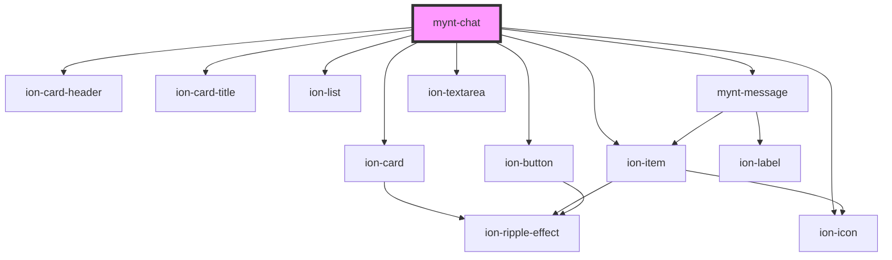

# mynt-chat

<!-- Auto Generated Below -->

## Properties

| Property | Attribute | Description | Type     | Default    |
| -------- | --------- | ----------- | -------- | ---------- |
| `name`   | `name`    |             | `string` | `"Parker"` |

## Dependencies

### Depends on

- ion-card
- ion-card-header
- ion-card-title
- ion-list
- [mynt-message](../mynt-message)
- ion-item
- ion-textarea
- ion-button
- ion-icon

### Graph

----------------------------------------------

*Built with [StencilJS](https://stenciljs.com/)*
