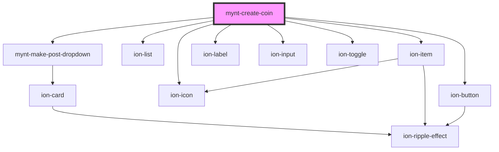

# mynt-create-coin

<!-- Auto Generated Below -->

## Dependencies

### Depends on

- [mynt-make-post-dropdown](../mynt-make-post-dropdown)
- ion-list
- ion-item
- ion-label
- ion-input
- ion-toggle
- ion-button
- ion-icon

### Graph

----------------------------------------------

*Built with [StencilJS](https://stenciljs.com/)*
