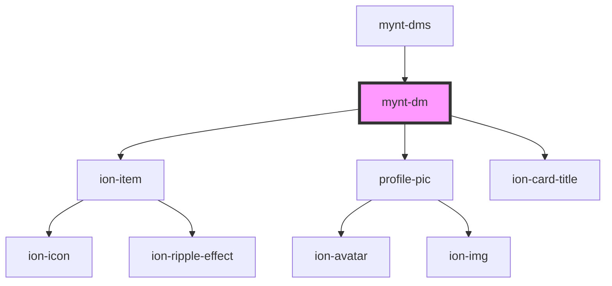

# mynt-dm

<!-- Auto Generated Below -->

## Properties

| Property  | Attribute  | Description | Type     | Default |
| --------- | ---------- | ----------- | -------- | ------- |
| `name`    | `name`     |             | `string` | `""`    |
| `profImg` | `prof-img` |             | `string` | `""`    |

## Dependencies

### Used by

 - [mynt-dms](../mynt-dms)

### Depends on

- ion-item
- [profile-pic](../profile-pic)
- ion-card-title

### Graph

----------------------------------------------

*Built with [StencilJS](https://stenciljs.com/)*
