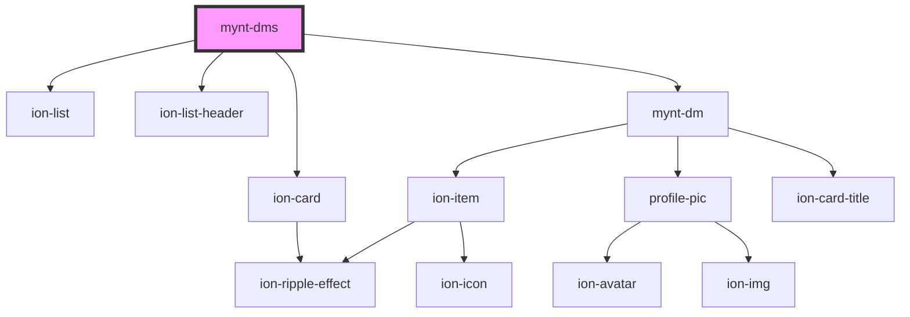

# mynt-dms

<!-- Auto Generated Below -->

## Properties

| Property | Attribute | Description | Type    | Default |
| -------- | --------- | ----------- | ------- | ------- |
| `data`   | --        |             | `any[]` | `[]`    |

## Dependencies

### Depends on

- ion-card
- ion-list
- ion-list-header
- [mynt-dm](../mynt-dm)

### Graph

----------------------------------------------

*Built with [StencilJS](https://stenciljs.com/)*
