# mynt-feed

<!-- Auto Generated Below -->

## Dependencies

### Depends on

- [mynt-post](../mynt-post)
- [mynt-page](../mynt-page)
- ion-card
- [mynt-side-list](../mynt-side-list)
- [mynt-make-post](../mynt-make-post)
- ion-content
- ion-list
- ion-item
- ion-infinite-scroll
- ion-infinite-scroll-content

### Graph

```mermaid
graph TD;
  mynt-feed --> mynt-post
  mynt-feed --> mynt-page
  mynt-feed --> ion-card
  mynt-feed --> mynt-side-list
  mynt-feed --> mynt-make-post
  mynt-feed --> ion-content
  mynt-feed --> ion-list
  mynt-feed --> ion-item
  mynt-feed --> ion-infinite-scroll
  mynt-feed --> ion-infinite-scroll-content
  mynt-post --> ion-card
  mynt-post --> ion-card-header
  mynt-post --> ion-item
  mynt-post --> profile-pic
  mynt-post --> ion-card-title
  mynt-post --> ion-card-subtitle
  mynt-post --> ion-card-content
  mynt-post --> ion-thumbnail
  mynt-post --> ion-img
  mynt-post --> ion-button
  mynt-post --> ion-icon
  ion-card --> ion-ripple-effect
  ion-item --> ion-icon
  ion-item --> ion-ripple-effect
  profile-pic --> ion-avatar
  profile-pic --> ion-img
  ion-button --> ion-ripple-effect
  mynt-page --> ion-grid
  mynt-page --> ion-row
  mynt-page --> ion-col
  mynt-side-list --> ion-card
  mynt-side-list --> ion-list
  mynt-side-list --> ion-list-header
  mynt-side-list --> mynt-side-listing
  mynt-side-listing --> ion-item
  mynt-side-listing --> profile-pic
  mynt-side-listing --> ion-card-title
  mynt-make-post --> ion-card
  mynt-make-post --> ion-item
  mynt-make-post --> profile-pic
  mynt-make-post --> ion-button
  mynt-make-post --> ion-select
  mynt-make-post --> ion-select-option
  mynt-make-post --> ion-icon
  mynt-make-post --> ion-label
  mynt-make-post --> ion-toggle
  ion-infinite-scroll-content --> ion-spinner
  style mynt-feed fill:#f9f,stroke:#333,stroke-width:4px
```

----------------------------------------------

*Built with [StencilJS](https://stenciljs.com/)*
