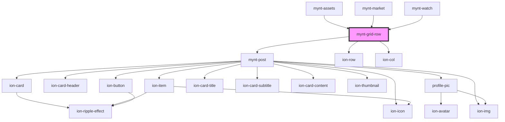

# mynt-grid-row

<!-- Auto Generated Below -->

## Properties

| Property  | Attribute  | Description | Type     | Default |
| --------- | ---------- | ----------- | -------- | ------- |
| `numCols` | `num-cols` |             | `number` | `0`     |

## Dependencies

### Used by

 - [mynt-assets](../mynt-assets)
 - [mynt-market](../mynt-market)
 - [mynt-watch](../mynt-watch)

### Depends on

- [mynt-post](../mynt-post)
- ion-row
- ion-col

### Graph

----------------------------------------------

*Built with [StencilJS](https://stenciljs.com/)*
