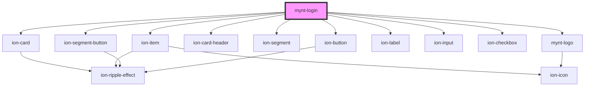

# mynt-login

<!-- Auto Generated Below -->

## Properties

| Property         | Attribute        | Description | Type      | Default |
| ---------------- | ---------------- | ----------- | --------- | ------- |
| `create_account` | `create_account` |             | `boolean` | `false` |

## Dependencies

### Depends on

- ion-card
- ion-item
- [mynt-logo](../mynt-logo)
- ion-card-header
- ion-segment
- ion-segment-button
- ion-label
- ion-input
- ion-checkbox
- ion-button

### Graph

----------------------------------------------

*Built with [StencilJS](https://stenciljs.com/)*
