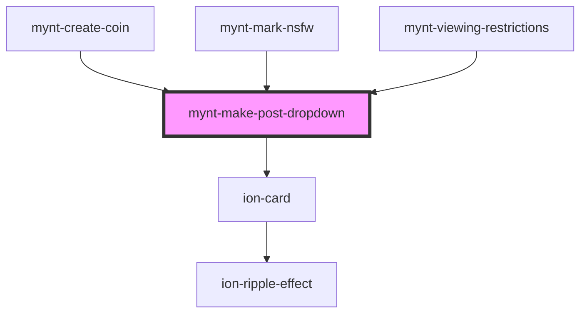

# mynt-make-post-dropdown

<!-- Auto Generated Below -->

## Dependencies

### Used by

 - [mynt-create-coin](../mynt-create-coin)
 - [mynt-mark-nsfw](../mynt-mark-nsfw)
 - [mynt-viewing-restrictions](../mynt-viewing-restrictions)

### Depends on

- ion-card

### Graph

----------------------------------------------

*Built with [StencilJS](https://stenciljs.com/)*
