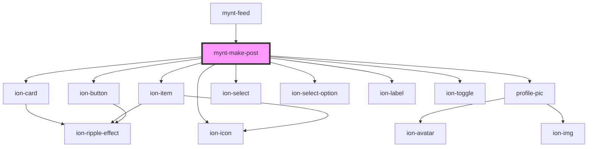

# mynt-make-post

<!-- Auto Generated Below -->

## Dependencies

### Used by

 - [mynt-feed](../mynt-feed)

### Depends on

- ion-card
- ion-item
- [profile-pic](../profile-pic)
- ion-button
- ion-select
- ion-select-option
- ion-icon
- ion-label
- ion-toggle

### Graph

----------------------------------------------

*Built with [StencilJS](https://stenciljs.com/)*
