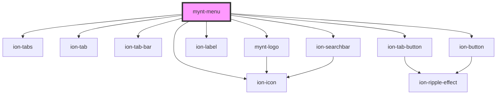

# mynt-menu

<!-- Auto Generated Below -->

## Dependencies

### Depends on

- ion-tabs
- ion-tab
- ion-tab-bar
- [mynt-logo](../mynt-logo)
- ion-label
- ion-searchbar
- ion-tab-button
- ion-button
- ion-icon

### Graph

----------------------------------------------

*Built with [StencilJS](https://stenciljs.com/)*
