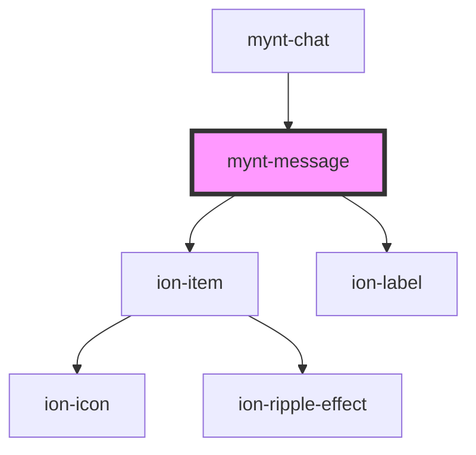

# mynt-message

<!-- Auto Generated Below -->

## Properties

| Property    | Attribute   | Description | Type      | Default        |
| ----------- | ----------- | ----------- | --------- | -------------- |
| `msg`       | `msg`       |             | `string`  | `""`           |
| `sent`      | `sent`      |             | `boolean` | `true`         |
| `timestamp` | `timestamp` |             | `string`  | `"1970/01/01"` |

## Dependencies

### Used by

 - [mynt-chat](../mynt-chat)

### Depends on

- ion-item
- ion-label

### Graph

----------------------------------------------

*Built with [StencilJS](https://stenciljs.com/)*
