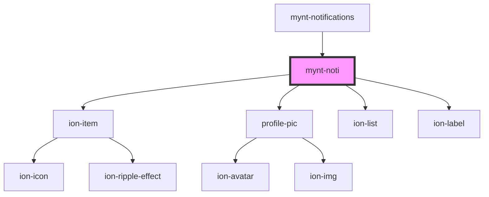

# mynt-noti

<!-- Auto Generated Below -->

## Properties

| Property | Attribute | Description | Type     | Default     |
| -------- | --------- | ----------- | -------- | ----------- |
| `assImg` | `ass-img` |             | `string` | `undefined` |
| `ttle`   | `ttle`    |             | `string` | `undefined` |
| `txt`    | `txt`     |             | `string` | `undefined` |

## Dependencies

### Used by

 - [mynt-notifications](../mynt-notifications)

### Depends on

- ion-item
- [profile-pic](../profile-pic)
- ion-list
- ion-label

### Graph

----------------------------------------------

*Built with [StencilJS](https://stenciljs.com/)*
