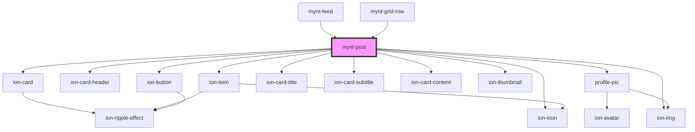

# mynt-post

<!-- Auto Generated Below -->

## Properties

| Property      | Attribute       | Description | Type     | Default |
| ------------- | --------------- | ----------- | -------- | ------- |
| `mediaPicSrc` | `media-pic-src` |             | `string` | `""`    |
| `name`        | `name`          |             | `string` | `""`    |
| `profPicSrc`  | `prof-pic-src`  |             | `string` | `""`    |
| `text`        | `text`          |             | `string` | `""`    |
| `user`        | `user`          |             | `string` | `""`    |

## Dependencies

### Used by

 - [mynt-feed](../mynt-feed)
 - [mynt-grid-row](../mynt-grid-row)

### Depends on

- ion-card
- ion-card-header
- ion-item
- [profile-pic](../profile-pic)
- ion-card-title
- ion-card-subtitle
- ion-card-content
- ion-thumbnail
- ion-img
- ion-button
- ion-icon

### Graph

----------------------------------------------

*Built with [StencilJS](https://stenciljs.com/)*
