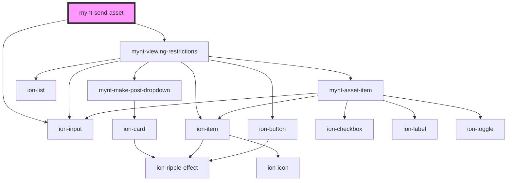

# mynt-send-asset

<!-- Auto Generated Below -->

## Dependencies

### Depends on

- [mynt-viewing-restrictions](../mynt-viewing-restrictions)
- ion-input

### Graph

----------------------------------------------

*Built with [StencilJS](https://stenciljs.com/)*
