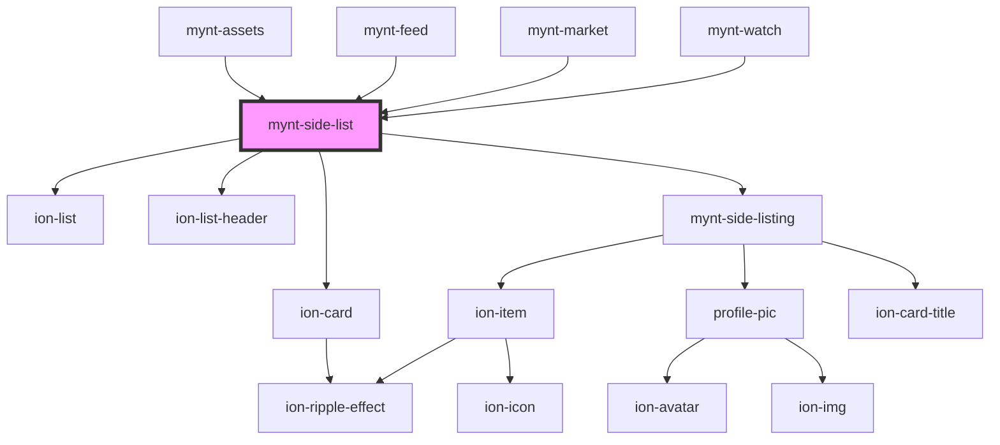

# mynt-side-list

<!-- Auto Generated Below -->

## Properties

| Property | Attribute | Description | Type     | Default |
| -------- | --------- | ----------- | -------- | ------- |
| `ttle`   | `ttle`    |             | `string` | `""`    |

## Dependencies

### Used by

 - [mynt-assets](../mynt-assets)
 - [mynt-feed](../mynt-feed)
 - [mynt-market](../mynt-market)
 - [mynt-watch](../mynt-watch)

### Depends on

- ion-card
- ion-list
- ion-list-header
- [mynt-side-listing](../mynt-side-listing)

### Graph

----------------------------------------------

*Built with [StencilJS](https://stenciljs.com/)*
