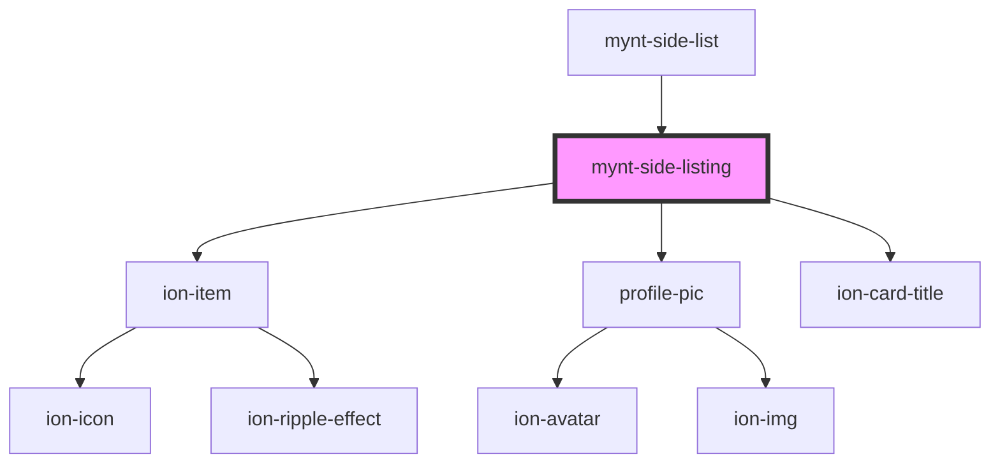

# mynt-side-listing

<!-- Auto Generated Below -->

## Properties

| Property | Attribute | Description | Type     | Default |
| -------- | --------- | ----------- | -------- | ------- |
| `image`  | `image`   |             | `string` | `""`    |
| `text`   | `text`    |             | `string` | `""`    |

## Dependencies

### Used by

 - [mynt-side-list](../mynt-side-list)

### Depends on

- ion-item
- [profile-pic](../profile-pic)
- ion-card-title

### Graph

----------------------------------------------

*Built with [StencilJS](https://stenciljs.com/)*
