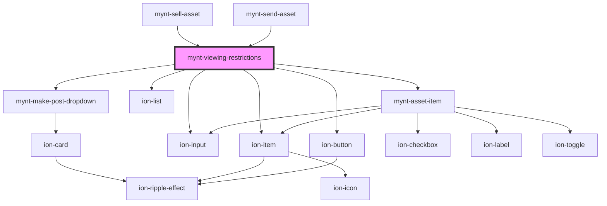

# mynt-viewing-restrictions

<!-- Auto Generated Below -->

## Dependencies

### Used by

 - [mynt-sell-asset](../mynt-sell-asset)
 - [mynt-send-asset](../mynt-send-asset)

### Depends on

- [mynt-make-post-dropdown](../mynt-make-post-dropdown)
- ion-item
- ion-input
- ion-button
- ion-list
- [mynt-asset-item](../mynt-asset-item)

### Graph

----------------------------------------------

*Built with [StencilJS](https://stenciljs.com/)*
