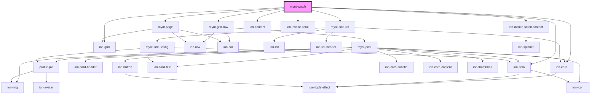

# mynt-watch

<!-- Auto Generated Below -->

## Dependencies

### Depends on

- [mynt-grid-row](../mynt-grid-row)
- [mynt-page](../mynt-page)
- ion-card
- [mynt-side-list](../mynt-side-list)
- ion-content
- ion-grid
- ion-item
- ion-infinite-scroll
- ion-infinite-scroll-content

### Graph

----------------------------------------------

*Built with [StencilJS](https://stenciljs.com/)*
