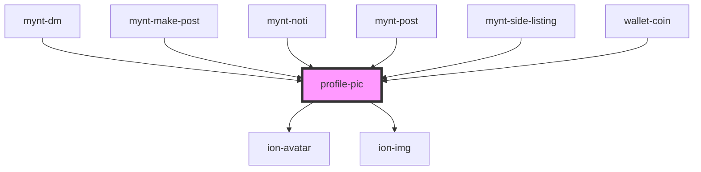

# profile-pic

<!-- Auto Generated Below -->

## Properties

| Property | Attribute | Description | Type     | Default |
| -------- | --------- | ----------- | -------- | ------- |
| `source` | `source`  |             | `string` | `""`    |

## Dependencies

### Used by

 - [mynt-dm](../mynt-dm)
 - [mynt-make-post](../mynt-make-post)
 - [mynt-noti](../mynt-noti)
 - [mynt-post](../mynt-post)
 - [mynt-side-listing](../mynt-side-listing)
 - [wallet-coin](../wallet-coin)

### Depends on

- ion-avatar
- ion-img

### Graph

----------------------------------------------

*Built with [StencilJS](https://stenciljs.com/)*
