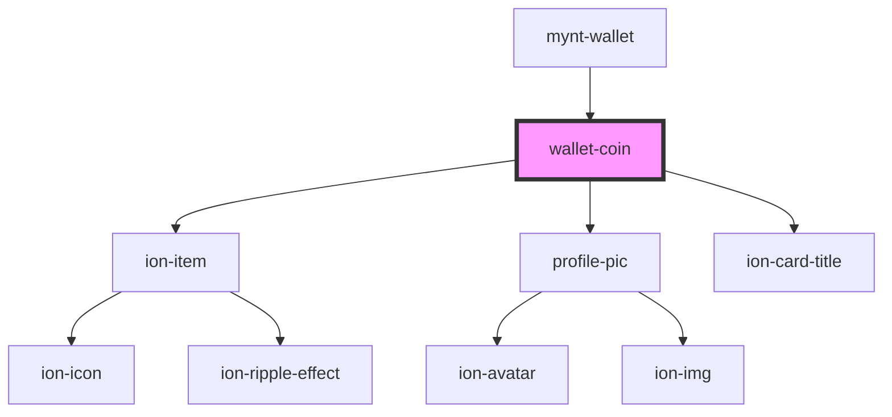

# wallet-coin

<!-- Auto Generated Below -->

## Properties

| Property    | Attribute    | Description | Type     | Default |
| ----------- | ------------ | ----------- | -------- | ------- |
| `coinImg`   | `coin-img`   |             | `string` | `""`    |
| `coinTitle` | `coin-title` |             | `string` | `""`    |

## Dependencies

### Used by

 - [mynt-wallet](../mynt-wallet)

### Depends on

- ion-item
- [profile-pic](../profile-pic)
- ion-card-title

### Graph

----------------------------------------------

*Built with [StencilJS](https://stenciljs.com/)*
